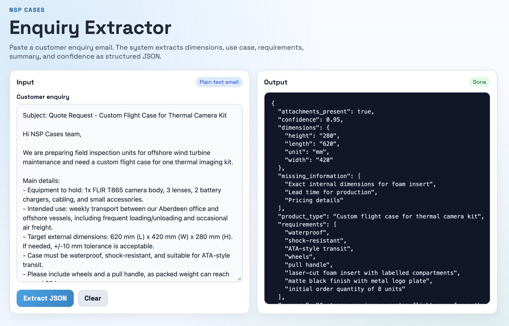
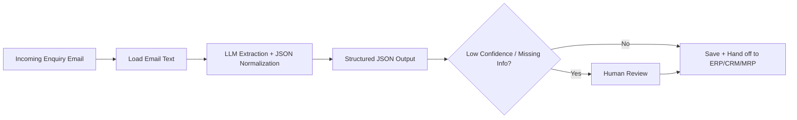

# NSP Cases AI Enquiry Workflow

Practical AI pipeline that converts unstructured customer enquiry emails into structured JSON for quote preparation and downstream operations.

## Demo Video
[Watch the demo walkthrough](assets/demo-walkthrough.mp4)

## UI Screenshot


## What This Project Does
- Accepts enquiry email text (CLI, API, or web UI)
- Extracts:
  - product type
  - dimensions (L/W/H/unit)
  - use case
  - key requirements
  - attachment mention flag
  - missing information
  - confidence
- Returns strict structured JSON
- Saves output to `output/example_output.json`

## Architecture
- `main.py`: core extraction logic and provider abstraction
- `app.py`: FastAPI app (`/`, `/api/extract`, `/health`, `/version`)
- `templates/` + `static/`: lightweight local frontend
- `evaluation/`: starter evaluation runner and fixtures
- `tests/`: unit/API tests

## Workflow Diagram


## API Schema (Output)
```json
{
  "product_type": "string",
  "dimensions": {
    "length": "string|null",
    "width": "string|null",
    "height": "string|null",
    "unit": "string|null"
  },
  "use_case": "string",
  "requirements": ["string"],
  "attachments_present": true,
  "summary": "string",
  "missing_information": ["string"],
  "confidence": 0.0
}
```

## Quick Start (Local)
1. Create virtualenv:
```bash
python3 -m venv .venv
source .venv/bin/activate
```

2. Install dependencies:
```bash
pip install -r requirements.txt
```

3. Configure environment:
```bash
cp .env.example .env
```
Set:
```env
OPENAI_API_KEY=your_real_key_here
```

4. Run CLI extraction:
```bash
python main.py
```

5. Run web app:
```bash
python app.py
```
Open:
`http://127.0.0.1:5000`

## API Usage
Health:
```bash
curl http://127.0.0.1:5000/health
```

Extract:
```bash
curl -X POST http://127.0.0.1:5000/api/extract \
  -H "Content-Type: application/json" \
  -d '{"email_text":"Need a waterproof case 620x420x280 mm for offshore use."}'
```

## Docker
Build and run with Docker:
```bash
docker build -t nsp-enquiry .
docker run --rm -p 8000:8000 --env-file .env nsp-enquiry
```
Then open:
`http://127.0.0.1:8000`

Or with Compose:
```bash
docker compose up --build
```

## Testing
Run unit and API tests:
```bash
pytest -q
```

## Evaluation Starter
Offline fixture schema check (no API call):
```bash
python evaluation/run_eval.py --offline
```

Live eval (uses LLM/API key):
```bash
python evaluation/run_eval.py
```
Output report:
`evaluation/results/latest_eval.json`

## Project Structure
```text
.
|-- .env.example
|-- .gitignore
|-- .dockerignore
|-- Dockerfile
|-- docker-compose.yml
|-- README.md
|-- app.py
|-- main.py
|-- requirements.txt
|-- sample_email.txt
|-- prompts/
|-- output/
|-- templates/
|-- static/
|-- evaluation/
|-- tests/
`-- assets/
```

## Design Decisions
- FastAPI for cleaner API contracts and easier service growth
- Core extraction kept separate from web layer for maintainability
- Prompt files externalized for fast iteration
- JSON normalization to protect downstream integrations
- Docker for reproducible execution
- Evaluation/test scaffolding to support reliability improvements

## Future Improvements
- Attachment parsing (PDF/image OCR)
- Queue + async worker mode for high-volume inboxes
- Confidence threshold routing and reviewer dashboard
- Direct connectors to CRM/ERP/MRP APIs
