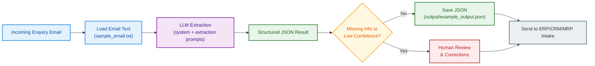

# NSP Cases AI Enquiry Workflow

This is a small, practical prototype for a hiring task.
The goal is simple: take a customer enquiry email for a custom flight case, extract the key details with AI, and produce clean JSON that a sales or operations team can actually use.

## Demo Video
[Watch the demo walkthrough](assets/demo-walkthrough.mp4)

## At A Glance
- Input: one enquiry email (`sample_email.txt`)
- Processing: prompt-guided AI extraction
- Output: structured JSON (`output/example_output.json`)
- Run mode: local Python app (no paid workflow platform required)

## Workflow Diagram


## Why This Exists
In real quoting workflows, important information often arrives as unstructured text.
That creates friction:
- details get missed
- follow-up takes longer
- handoff to operations is inconsistent

This prototype solves that first mile by turning free text into a predictable schema.

## What The App Extracts
The script returns these fields:
- `product_type`
- `dimensions.length`
- `dimensions.width`
- `dimensions.height`
- `dimensions.unit`
- `use_case`
- `requirements`
- `attachments_present`
- `summary`
- `missing_information`
- `confidence`

## Output Schema
```json
{
  "product_type": "string",
  "dimensions": {
    "length": "string|null",
    "width": "string|null",
    "height": "string|null",
    "unit": "string|null"
  },
  "use_case": "string",
  "requirements": ["string"],
  "attachments_present": true,
  "summary": "string",
  "missing_information": ["string"],
  "confidence": 0.0
}
```

## Quick Start
1. Create a virtual environment:
```bash
python3 -m venv .venv
source .venv/bin/activate
```
2. Install dependencies:
```bash
pip install -r requirements.txt
```
3. Create your env file:
```bash
cp .env.example .env
```
4. Add your API key in `.env`:
```env
OPENAI_API_KEY=your_real_key_here
```
5. Run the app:
```bash
python main.py
```

Expected behavior:
- JSON is printed in the terminal
- JSON is saved to `output/example_output.json`

## Sample Input / Output
- Input file: `sample_email.txt`
- Output file: `output/example_output.json`

Input excerpt:
```text
Subject: Quote Request - Custom Flight Case for Thermal Camera Kit
...
- Target external dimensions: 620 mm (L) x 420 mm (W) x 280 mm (H)
- Case must be waterproof, shock-resistant, and suitable for ATA-style transit.
...
I have attached:
1) a simple internal layout sketch (PDF)
2) one reference photo of our current case setup (JPG)
```

Output excerpt:
```json
{
  "product_type": "Custom shock-resistant flight case for thermal camera inspection kit",
  "dimensions": {
    "length": "620",
    "width": "420",
    "height": "280",
    "unit": "mm"
  },
  "attachments_present": true,
  "confidence": 0.93
}
```

## Design Decisions
- Keep architecture simple and interview-appropriate (`main.py` as single entry point)
- Keep prompts in files (`prompts/`) so tuning does not require code edits
- Isolate the provider call so Claude/Gemini/OpenAI can be swapped later
- Normalize model output into a stable JSON shape for downstream reliability
- Include missing-info detection and confidence to support human review

## Project Structure
```text
.
|-- .env.example
|-- .gitignore
|-- README.md
|-- assets
|   `-- demo-walkthrough.mp4
|-- main.py
|-- output
|   `-- example_output.json
|-- prompts
|   |-- extraction_prompt.txt
|   `-- system_prompt.txt
|-- requirements.txt
`-- sample_email.txt
```

## How This Can Scale
1. Email intake captures new enquiries
2. AI extraction converts free text to structured JSON
3. Business rules + optional human review handle low-confidence cases
4. Approved data flows into CRM/ERP/MRP quoting and planning

## Optional Automation Layer (Make / n8n)
This repo runs locally by itself.
If needed later, orchestration can be added with Make or n8n for:
- email trigger
- LLM call
- JSON parsing
- write to CRM/ERP table
- review routing for low-confidence responses

## Future ERP/MRP Integration Ideas
- Create enquiry records with structured technical and commercial fields
- Trigger quote-preparation tasks for engineering/sales
- Route missing information back for customer follow-up
- Feed approved data into planning/BOM workflows

## Notes
- This is a prototype intended for interview demonstration
- API usage may incur costs, depending on provider/account
